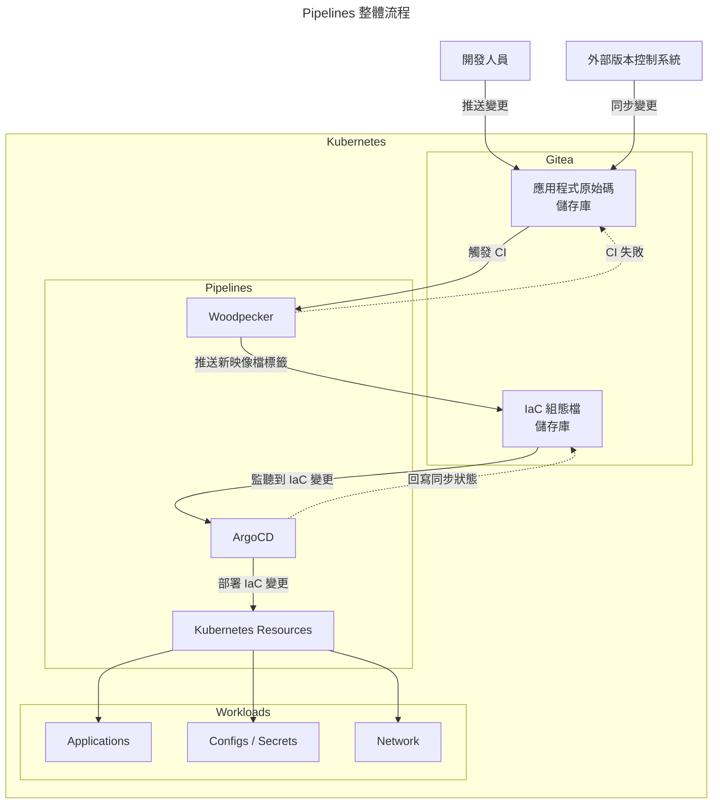

# 建置地端的 CI/CD Pipelines

<!-- markdownlint-disabled MD028 -->
<!-- markdownlint-disabled MD033 -->

由於 GitHub Actions 目前連 Self-hosted 也要收平台費了，考慮到未來還是有使用 CI/CD Pipeline 的需求，因此有了這個專案

本專案會初步說明選用哪些工具，後續才會慢慢研究如何串接這些系統

## Table of Contents

- [前置需求](#前置需求)
  - [要先了解的概念](#要先了解的概念)
  - [工具準備](#工具準備)
- [工具選用](#工具選用)

## 前置需求

執行前還是要有一些基本概念，下面會條列出哪些是必要的概念以及工具

### 要先了解的概念

- DevOps
- GitOps
- CI/CD
- Shell scripts
- Kubernetes

### 工具準備

- 至少一個 Kubernetes 叢集
- 具備 Kubernetes 叢集管理員的使用者帳戶
- kubectl
- helm

## 工具選用

CI/CD 的工具目前選擇為 Gitea + Woodpecker CI + ArgoCD，Gitea 本身就是版本控制系統，搭配 Woodpecker CI 和 ArgoCD 完成整個流程，其中 ArgoCD 是以 GitOps 為基礎實作，因此才會需要有基礎知識

> [!NOTE]
> Woodpecker CI 和 ArgoCD 就不會對外開放，僅有 Gitea 會有外部往內推送程式碼的可能

下面是整個執行的流程

